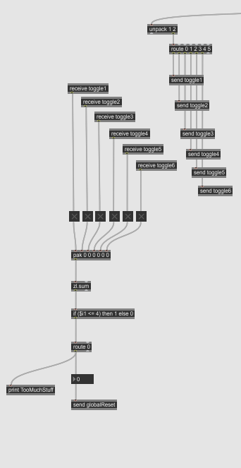
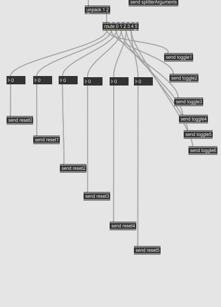
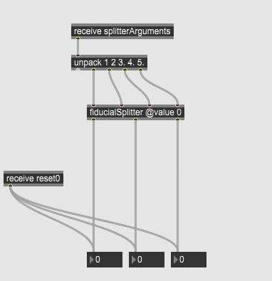
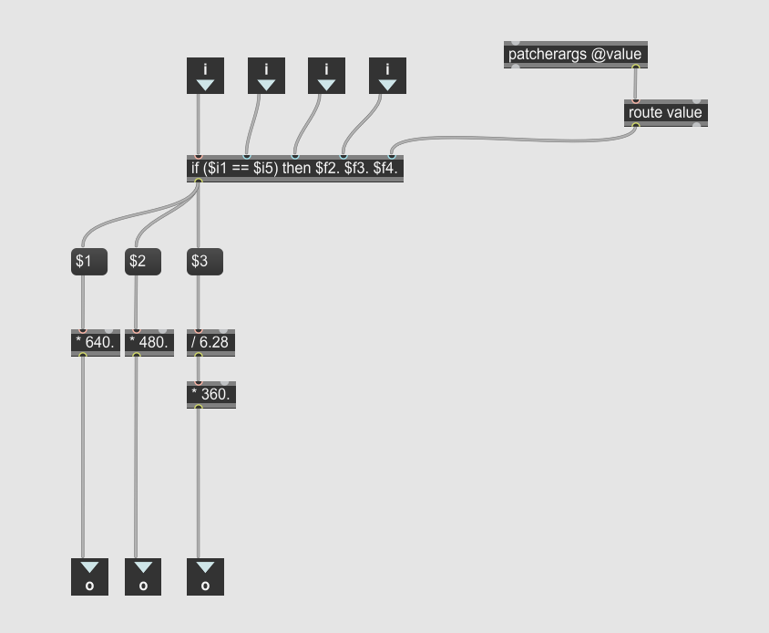

# Prototype de détection de plusieurs fiducials spécifiques

Dans mon prototype, je démontre qu'il est possible lorsqu'on reçoit les informations de reacTIVision dans max de séparer les données liés à chacun des fiducials et qu'il est possible de déterminé quel fiducial est présentement présent sur la caméra. Le patcher max du prototype est présent dans le fichier média de ce repository, j'ai également crée un autre patcher qui utilise le logiciel Open Stage Control, ce patcher va servir pendant la production du projet à tester ce qu'on fait dans un environement virtuel avant de les faire fonctionner avec notre table.

## Explications du patcher reacTIVision

### TuioClient

TuioClient est un package max permettant au logiciel de communique par le protocole Tuio, ce protocole à été créé originalement pour la reactable et est basé sur l'OSC. Si aucun port n'est spécifié, il écoute le port 3333, qui est le même port que reacTIVision. Lorsque max reçoit les informations, elles sont divisées en 3 catégories, le route est utilisé pour les séparer. Ce qui est fait avec les 3 données sera expliqué dans leurs propres catégories.
 
 

### addObject

addObject est déclenché quand un nouvel objet apparaît, cette information est traitée avec les ID des fiducials, et dépendement de quel ID est détecté, un toggle est activé, lorsque plus de 4 toggles sont activés, un print apparaît dans la console, mais il n'y a pas d'impact sur le patcher lui-même, la raison étant que cette information sera traîtée plus tard dans Unity.
 
 

### removeObject

removeObject est déclenché quand reacTIVision perd de vue un fiducial, comme pour addObject, on envoit un message à un toggle dépendement de l'ID du fiducial perdu afin d'éteindre le toggle. Une information est également envoyé vers la position des fiducials sur l'écran, mettant tout à zéro.
 
 

### updateObject

updateObject est l'élément qui est appelé à chaque tick, il est utilisé surtout pour déterminer la position présente d'un fiducial, cette partie du patcher était le vrai défi du prototype, car je devais m'assurer de pouvoir séparer les données de chaque élément et d'avoir les données de chacuns de manière isolée. Contrairement à Open Stage Control, qui est utilisé dans le prototype virtuel, reacTIVision envoi les données de chaque objet séparément, je devais donc trouver un moyen de m'assurer que même si l'information arrive partout, qu'elle ne soit utilisée qu'à l'endroit où elle est nécéssaire. La réponse était de créer un if dans un subpatcher et de lui donner un argument équivalent à l'ID du fiducial voulu, de cette façon, lorsque le if est appelé, il est faux partout sauf à l'endroit qui donnait cette condition, par exemple, si je scanne le fiducial 2, le if serait quelque chose comme if(fiducialID == 2), ce qui serait appelé partout, mais ne serait que vrai à l'endroit qui reçoit le chiffre 2.
 
 

 
updateObject
 

 
subpatcher

