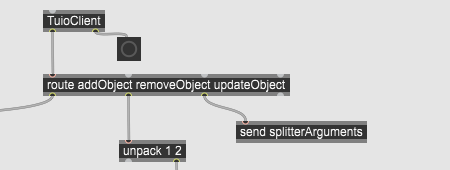

# Prototype de détection de plusieurs fiducials spécifiques

Dans mon prototype, je démontre qu'il est possible lorsqu'on reçoit les informations de reacTIVision dans max de séparer les données liés à chacun des fiducials et qu'il est possible de déterminé quel fiducial est présentement présent sur la caméra. Le patcher max du prototype est présent dans le fichier média de ce repository, j'ai également crée un autre patcher qui utilise le logiciel Open Stage Control, ce patcher va servir pendant la production du projet à tester ce qu'on fait dans un environement virtuel avant de les faire fonctionner avec notre table.

## Explications du patcher reacTIVision

### TuioClient

TuioClient est un package max permettant au logiciel de communique par le protocole Tuio, ce protocole à été créé originalement pour la reactable et est basé sur l'OSC. Si aucun port n'est spécifié, il écoute le port 3333, qui est le même port que reacTIVision. Lorsque max reçoit les informations, elles sont divisées en 3 catégories, le route est utilisé pour les séparer.

